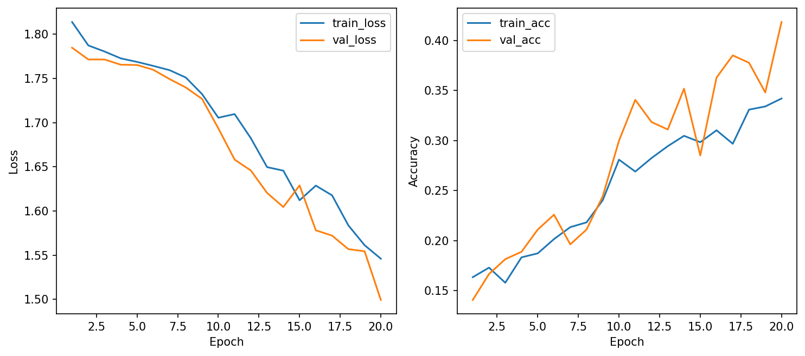
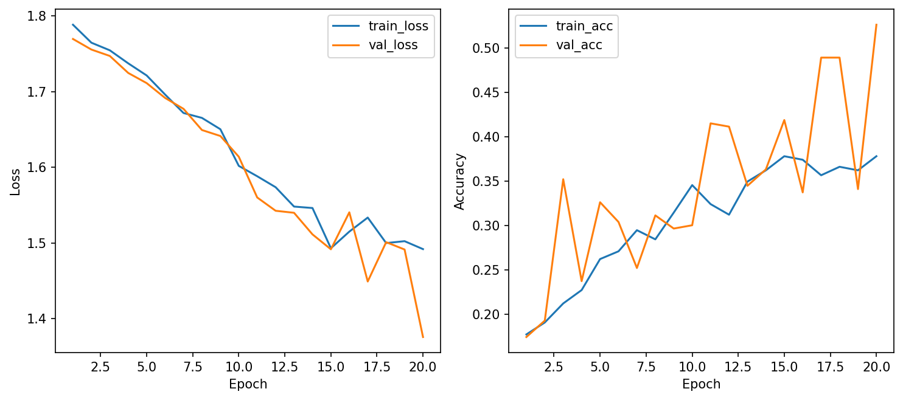
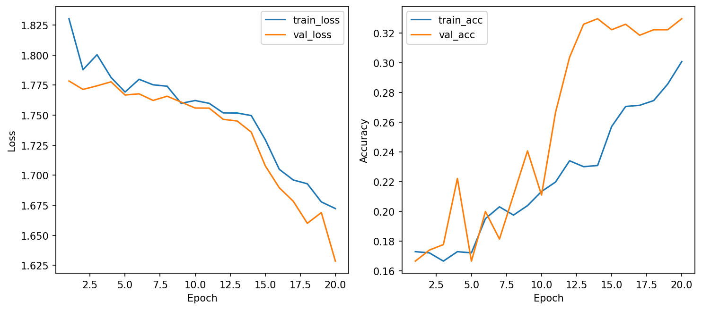
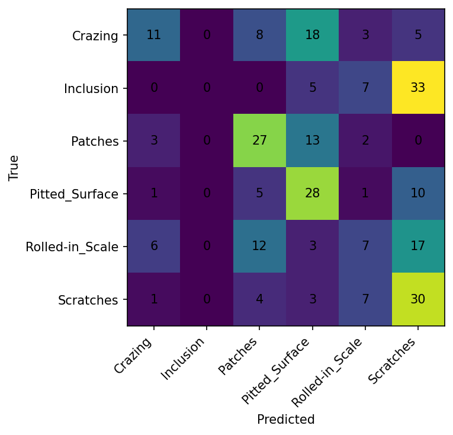
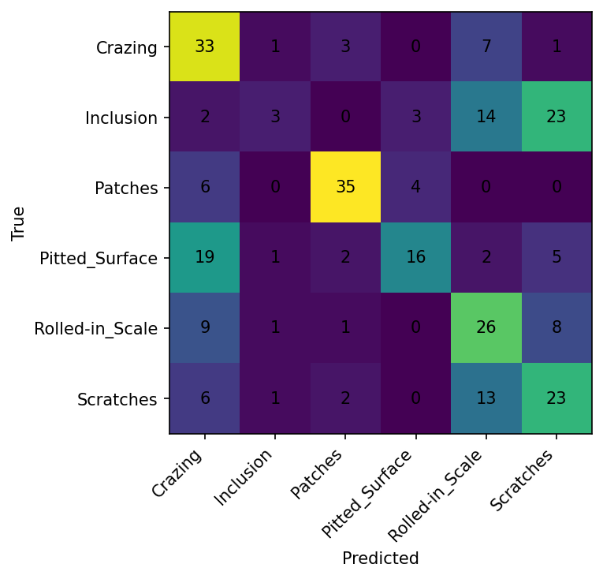
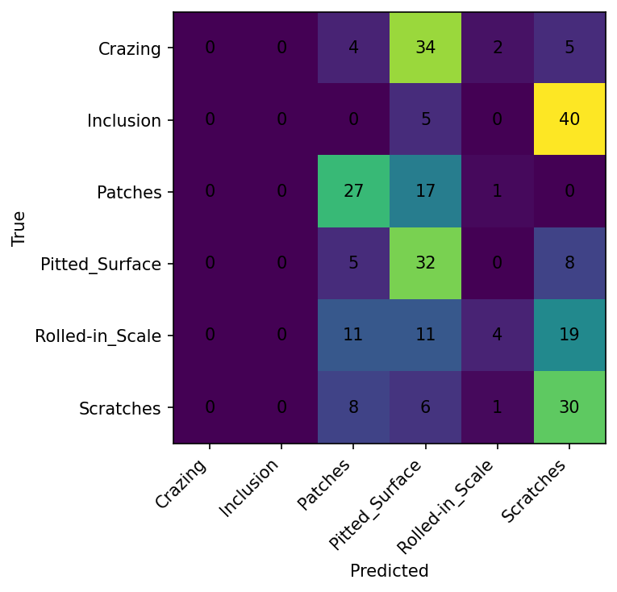

# CSC4005 – Lab 1 Report Template

## 1. Mục tiêu

### 1.1 Mục tiêu bài thực hành
Mục tiêu chính của bài lab này là xây dựng một pipeline huấn luyện hoàn chỉnh cho bài toán phân loại hình ảnh bằng mạng nơ-ron truyền thẳng (MLP). Thay vì tập trung tối ưu hóa điểm số, bài thực hành chú trọng vào việc giúp sinh viên nắm vững quy trình bài bản trong học sâu, bao gồm:

- Xử lý dữ liệu: Chuẩn bị và chuẩn hóa dữ liệu hình ảnh đúng cách.

- Huấn luyện & Đánh giá: Hiểu rõ vai trò của các tập dữ liệu Train, Validation, Test và lựa chọn hàm mất mát (Loss function) phù hợp.

- Kiểm soát mô hình: Theo dõi và xử lý hiện tượng Overfitting và Underfitting thông qua các kỹ thuật Regularization.

- Tối ưu hóa: So sánh hiệu quả của các bộ tối ưu (Optimizer) khác nhau.

- Quản lý thí nghiệm: Sử dụng công cụ Weights & Biases (W&B) để ghi lại toàn bộ quá trình thực nghiệm, từ biểu đồ học tập (Learning curves) đến bảng so sánh cấu hình.

### 1.2 Bộ dữ liệu sử dụng

Bài thực hành sử dụng bộ dữ liệu NEU Surface Defect Database. Đây là bộ dữ liệu thực tế dùng để nhận diện các lỗi trên bề mặt thép, bao gồm 1.800 ảnh được chia thành 06 lớp đối tượng:

- Crazing (Vết nứt bề mặt)

- Inclusion (Tạp chất)

- Patches (Mảng bám)

- Pitted Surface (Bề mặt rỗ)

- Rolled-in Scale (Vảy cán thép)

- Scratches (Vết trầy xước)

## 2. Cấu hình thí nghiệm

Phần này trình bày các thiết lập thông số cho 3 kịch bản huấn luyện khác nhau nhằm so sánh hiệu năng giữa các bộ tối ưu (Optimizer) và mức độ tác động của các kỹ thuật điều chuẩn (Regularization).

### 2.1 Các tham số chung
Tất cả các thí nghiệm đều sử dụng chung các cấu hình nền tảng sau để đảm bảo tính khách quan khi so sánh:
- Dữ liệu: NEU-CLS dataset.
- Kích thước ảnh: 64 x 64 pixels.
- Batch size: 32.
- Số Epoch tối đa: 20.
- Early Stopping: Dừng sớm nếu không cải thiện sau 5 epoch (patience=5).
- Augmentation: Có sử dụng tăng cường dữ liệu.
- Công cụ theo dõi: Weights & Biases (wandb).
### 2.2 Chi tiết các cấu hình chạy (Runs)
Dưới đây là bảng tổng hợp thông số chi tiết cho 3 lần chạy:

Tham số |	Run 1: Baseline (AdamW) |	Run 2: SGD |	Run 3: Strong Reg
---------  | --------- | --------- | ---------
Run Name |	baseline_adamw |	run_b_sgd |	run_c_strong_reg
Optimizer |	AdamW |	SGD |	AdamW
Learning Rate |	0.001 |	0.01 |	0.0005
Weight Decay |	0.0001 |	0.0 |	0.001
Dropout |	0.3 |	0.3 |	0.5

### 2.3 Mô tả mục tiêu từng cấu hình
#### Cấu hình Baseline (baseline_adamw):

- Sử dụng bộ tối ưu AdamW với các tham số tiêu chuẩn.

- Mục tiêu: Thiết lập một mốc hiệu năng cơ bản để so sánh với các thay đổi sau này.

#### Cấu hình So sánh Optimizer (run_b_sgd):

- Thay đổi sang bộ tối ưu SGD với Learning Rate lớn hơn (0.01) và tắt Weight Decay.

- Mục tiêu: Đánh giá tốc độ hội tụ và độ ổn định của SGD so với AdamW trên bài toán phân loại ảnh lỗi thép.

#### Cấu hình Điều chuẩn mạnh (run_c_strong_reg):

- Giảm Learning Rate, tăng Weight Decay lên gấp 10 lần và tăng Dropout lên 0.5.

- Mục tiêu: Quan sát khả năng kiểm soát hiện tượng Overfitting, giúp mô hình tổng quát hóa tốt hơn trên tập Validation và Test.
## 3. Kết quả
### 3.1 Bảng so sánh cấu hình (Metrics)
Chỉ số |	Run 1: Baseline (AdamW) |	Run 2: SGD |	Run 3: Strong Reg
---------  | --------- | --------- | ---------
Best Val Accuracy |	41.85% |	52.59% |	32.96%
Test Accuracy |	38.15% |	50.37% |	34.44%
Best Val Loss |	1.4993 |	1.3757 |	1.6286
Test Loss |	1.4957 |	1.3544 |	1.6021

### 3.2 Learning Curves (Nhận xét chung)
- Baseline:

- Run 2 (SGD): Cho thấy xu hướng hội tụ tốt nhất và ổn định nhất về mặt độ chính xác trên cả tập Validation và Test.

- Run 3 (Strong Reg): Do áp dụng Dropout (0.5) và Weight Decay (0.001) quá cao, mô hình gặp khó khăn trong việc học các đặc trưng quan trọng, dẫn đến kết quả thấp nhất trong 3 kịch bản.

### 3.3 Confusion Matrix

- Baseline:

- Run 2 (SGD): 

- Run 3 (Strong Reg): 

## 4. Phân tích

### 4.1 Cấu hình tốt nhất
Cấu hình Run 2 (SGD) là cấu hình tốt nhất với độ chính xác trên tập Test đạt 50.37%. Mặc dù MLP không phải là kiến trúc mạnh nhất cho bài toán hình ảnh, nhưng việc điều chỉnh Learning Rate lên 0.01 kết hợp với bộ tối ưu SGD đã giúp mô hình thoát khỏi các cực tiểu cục bộ tốt hơn so với AdamW trong bối cảnh này.
### 4.2 Dấu hiệu Overfitting / Underfitting
- Underfitting: Xuất hiện rõ rệt ở Run 3. Độ chính xác tập Test chỉ đạt ~34% và Precision của các lớp như Crazing, Inclusion bằng 0. Điều này cho thấy mô hình quá đơn giản hoặc bị kìm hãm bởi các tham số điều chuẩn quá mạnh, không thể học được sự khác biệt giữa các loại lỗi.

- Overfitting: Xuất hiện nhẹ ở Run 1. Khoảng cách giữa best_val_loss (1.49) và test_loss bắt đầu có sự chênh lệch nhẹ về độ chính xác (Val 41% vs Test 38%).

### 4.3 So sánh AdamW và SGD
- AdamW (Run 1): Hội tụ nhanh nhưng dễ bị kẹt ở mức hiệu năng trung bình (~40%). Nó gặp khó khăn đặc biệt với lớp Inclusion (Recall = 0%).

- SGD (Run 2): Với Learning Rate lớn hơn (0.01), SGD tỏ ra hiệu quả hơn trong việc phân loại các lớp khó. Ví dụ, lớp Patches đạt F1-score rất cao (0.79) so với AdamW chỉ đạt 0.53. SGD giúp mô hình có cái nhìn tổng quát hơn đối với bộ dữ liệu NEU.

## 5. Kết luận
Mô hình được chọn là cấu hình Run 2 (SGD).

Lý do lựa chọn:

- Hiệu năng vượt trội: Đạt độ chính xác cao nhất trên tập Test (50.37%), cao hơn cấu hình Baseline gần 12%.

- Khả năng phân loại đồng đều: Khác với Run 1 và Run 3 (bị liệt hoàn toàn ở lớp Inclusion), Run 2 đã bắt đầu nhận diện được đa số các lớp lỗi, đặc biệt là sự cải thiện mạnh mẽ ở lớp Crazing (Recall tăng từ 24% lên 73%).

- Độ tin cậy: Khoảng cách giữa kết quả Validation và Test của Run 2 là rất nhỏ (~2%), chứng tỏ mô hình có khả năng tổng quát hóa tốt trên dữ liệu mới.

